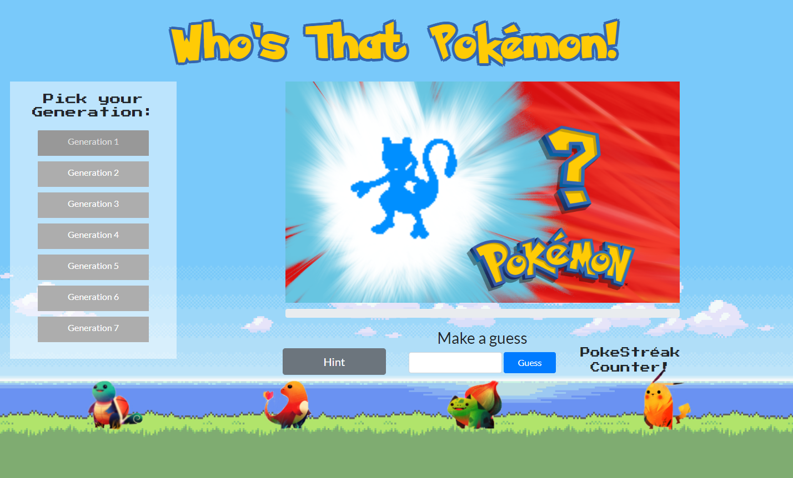

# Who's That Pokémon

#### By Kevin Ahn

## Description

Who's That Pokémon is a web app built with Angular and the Pokéapi to simulate the guessing game featured on the original Pokémon show during the commercial bumpers.

## Screen Shot

## User Stories

* As a user, I am able to choose which generation I am quizzed on.
* As a user, I am able to see a Pokémon silhouette and guess which Pokémon that is.
* As a user, if I am incorrect, I should be able to see a hint.
* As a user, if I am correct, I should be able to see the full iamge of the Pokémon.
* As a user, I am able to see how many times I am correct in a row.
* As a user, I am able to see how many times I am incorrect in a row.
* As a user, I am able to give up and see the answer after an incorrect guess.

## Flow chart

## Technologies Used

* Angular 5
* BootStrap 4
* Pokéapi
* Sass

## Development server

Run `ng serve` for a dev server. Navigate to `http://localhost:4200/`. The app will automatically reload if you change any of the source files.

## Code scaffolding

Run `ng generate component component-name` to generate a new component. You can also use `ng generate directive|pipe|service|class|guard|interface|enum|module`.

## Build

Run `ng build` to build the project. The build artifacts will be stored in the `dist/` directory. Use the `-prod` flag for a production build.

## Running unit tests

Run `ng test` to execute the unit tests via [Karma](https://karma-runner.github.io).

## Running end-to-end tests

Run `ng e2e` to execute the end-to-end tests via [Protractor](http://www.protractortest.org/).

## Further help

To get more help on the Angular CLI use `ng help` or go check out the [Angular CLI README](https://github.com/angular/angular-cli/blob/master/README.md).

## Links

* [Github Repo] (https://github.com/kevinahn7/whos-that-pokemon)
* [Live Site] (https://whos-that-pokemon-57ff9.firebaseapp.com/)

## License

This software is licensed under the MIT license.

Copyright (c) 2018 **Kevin Ahn**